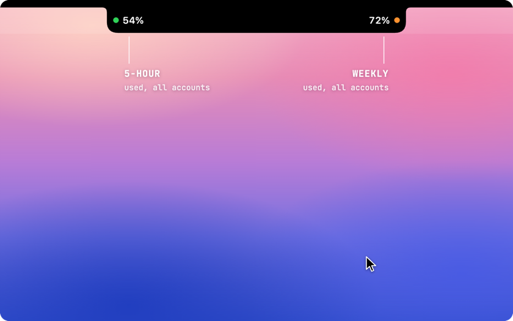
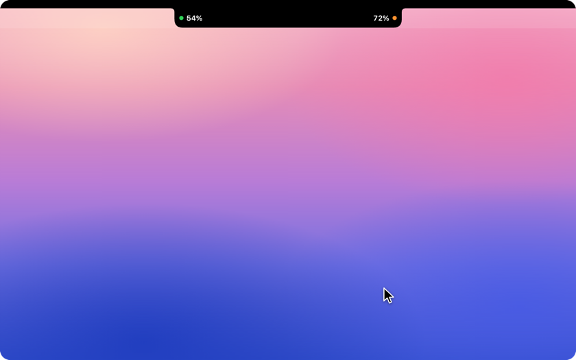
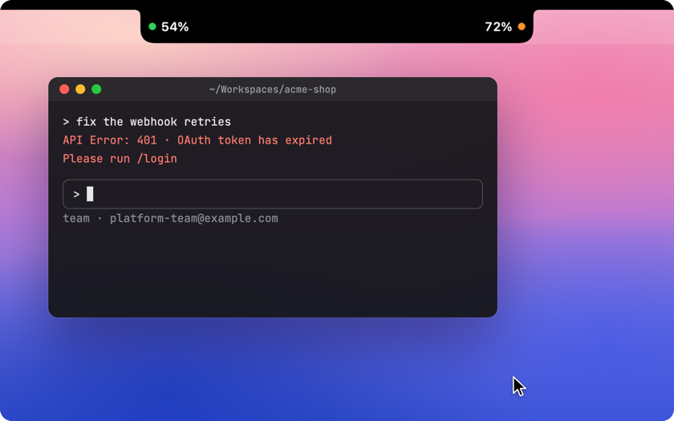
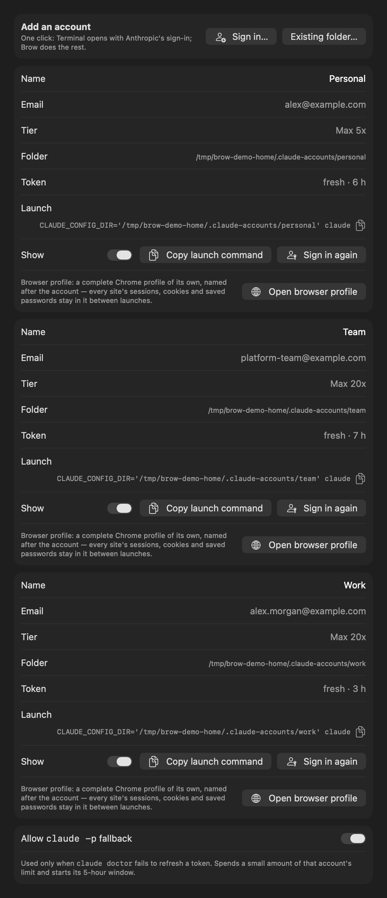

# Brow — Claude Code rate limits in the MacBook notch

A macOS app that shows the **usage and rate limits of every [Claude Code](https://claude.com/claude-code) account** you have, right in the MacBook notch: the 5-hour limit, the weekly limit, and when each resets. One click signs you in to an account in a browser profile that belongs to that account alone.

It is for people who keep several Claude subscriptions and run a separate stream of AI-assisted work on each. Brow shows at a glance which account is close to its limit, which has room, and when each one frees up.

**[Download Brow for macOS](https://github.com/efim0v/brow/releases/latest/download/Brow.zip)** · macOS 26 or later, Apple silicon · [install notes](#install)

### Which account still has room

Hover the notch: every account's 5-hour and weekly limits open out of it. Copy an account's launch command and Claude Code starts as that account.

<p align="center"><picture>
  <source media="(prefers-reduced-motion: reduce)" srcset="docs/media/brow-hero-v1.png">
  <source type="image/webp" srcset="docs/media/brow-hero-v1.webp">
  
</picture></p>

### When each limit resets

The calendar marks every account's weekly resets and subscription renewals. Point at a day to see what frees up.

<p align="center"><picture>
  <source media="(prefers-reduced-motion: reduce)" srcset="docs/media/brow-calendar-v1.png">
  <source type="image/webp" srcset="docs/media/brow-calendar-v1.webp">
  
</picture></p>

### Sign in again in one click

When an account's sign-in expires, the key next to it starts `claude auth login` for that account and opens the browser profile that belongs to it, already signed in to that account. Other accounts stay signed in.

<p align="center"><picture>
  <source media="(prefers-reduced-motion: reduce)" srcset="docs/media/brow-signin-v1.png">
  <source type="image/webp" srcset="docs/media/brow-signin-v1.webp">
  
</picture></p>

All demos show made-up demo data.

> **Companion app: [Grove](https://github.com/efim0v/grove).** Grove gives each feature of a multi-repo project its own workspace for Claude Code and moves a session from one account to another. Brow tells you which account has room; Grove moves the work there. Each runs on its own, and they are built to be used together.

## What it does

- **Every account at a glance.** For each account: the 5-hour limit, the weekly limit and any model-specific weekly limit, as percent used, with the time until each resets.
- **A reset calendar.** Weekly resets and estimated subscription renewals on a month grid, so you can see which account frees up when.
- **Copy the launch command.** One button copies the command that starts Claude Code as that account.
- **Sign in again, in that account's own browser.** Each account gets a separate browser profile — its own cookies, history and saved logins — so signing in to one never disturbs another. A second button opens that profile directly.
- **Add an account in one click.** Brow creates the account folder and opens Anthropic's own sign-in flow.
- **Tokens kept fresh.** Idle accounts are refreshed in the background, so the numbers do not go stale.

Separate browser profiles need Google Chrome, Chromium, Brave or Edge. Without one of them links open in your default browser, with no isolation. More detail on pacing, refresh and layout options is in [`docs/brow.md`](docs/brow.md).

<p align="center">
  
</p>

Collapsed, Brow shows two numbers beside the notch: how much of the 5-hour limit and of the weekly limit is used across your accounts. Hover and it opens into the panel above. The readouts can also sit in a strip below the notch:

<p align="center">
  
</p>

## How Brow and Grove fit together

Claude Code keeps each account in its own directory: `~/.claude` for the default account and `~/.claude-accounts/<name>` for the others. Both apps read those directories; neither talks to the other directly.

- **Accounts.** Brow creates account folders when you sign in; Grove picks them up and can launch any session under any of them.
- **The browser router.** Brow ships a small script that opens links in the right account's browser profile. When Brow is installed, Grove passes that script to every Claude Code session it starts, so a sign-in prompt from a session lands in the right profile.
- **Shared code.** The account, credential and usage logic lives in Grove's `GroveCore` library, which this package depends on.

The full picture, including how sessions are shared between accounts, is in [Grove's README](https://github.com/efim0v/grove#how-grove-and-brow-fit-together) and in [`docs/grove-and-brow.md`](docs/grove-and-brow.md).

<p align="center">
  <a href="https://github.com/efim0v/grove"></a>
</p>

## What Brow does on your machine

Worth knowing before you run it:

- **Brow reads Claude Code's sign-in token from the macOS Keychain** — macOS asks once per account — and uses it only to call Anthropic's usage and profile endpoints. Those endpoints are not a documented public API and may change. No token is written to disk or logged, and nothing is sent anywhere else.
- **The fallback token refresh is on by default.** If the normal refresh stops working Brow runs a tiny `claude -p` request, which spends a little limit and starts that account's 5-hour window. Turn it off in Settings → Accounts.
- **Each account's browser profile is a separate directory** under `~/Library/Application Support/Brow/browser-profiles/`. Brow sets the profile's name and allows third-party cookies in it so that sign-in works.
- **Signing in opens Terminal** with `claude auth login`; macOS asks once for permission to control Terminal.

This is an independent tool, not affiliated with or endorsed by Anthropic.

## Requirements

- macOS 26 or later. The notch layout is for MacBooks with a notch; on other displays Brow shows a pill.
- Xcode with Swift 6.2, to build.
- [Claude Code](https://claude.com/claude-code).
- For separate browser profiles: Chrome, Chromium, Brave or Edge.

## Install

Download **[Brow.zip](https://github.com/efim0v/brow/releases/latest/download/Brow.zip)** from the [latest release](https://github.com/efim0v/brow/releases/latest), unzip it and move `Brow.app` to `/Applications`.

The build is signed ad hoc and is not notarized by Apple, so macOS blocks the first launch. Open **System Settings → Privacy & Security**, find the message about Brow and press **Open Anyway** — or clear the quarantine flag yourself:

```sh
xattr -dr com.apple.quarantine /Applications/Brow.app
```

On first launch macOS asks once per account for access to Claude Code's Keychain item — choose **Always Allow**. Because the build is signed ad hoc, macOS asks again after you update to a newer build.

`SHA256SUMS.txt` in the release is there to check the download against.

## Build

```sh
git clone https://github.com/efim0v/brow.git
cd brow

swift test                 # fetches GroveCore from the Grove repository
Scripts/build-brow.sh      # -> dist/Brow.app
cp -R dist/Brow.app /Applications/
```

The app is signed ad hoc by default. macOS then forgets the Keychain and Automation permissions on every rebuild; to keep them, set `GROVE_SIGN_IDENTITY` to your own `Apple Development: Name (TEAMID)` identity before building.

## Layout

| Path | What it is |
|---|---|
| `Sources/BrowKit` | The app: notch panel and geometry, limits store, views, settings |
| `Sources/BrowApp` | Entry point |
| `Resources/brow-browser.sh` | The per-account browser router |
| `Tests/BrowKitTests` | About 150 tests |
| `docs` | [Brow in detail](docs/brow.md), [how Brow and Grove fit together](docs/grove-and-brow.md) |

The only dependency is [`GroveCore`](https://github.com/efim0v/grove) from the Grove repository.

## Development

- The screenshots in this README are regenerated with
  `DEMO_SCREENSHOTS_DIR="$PWD/docs/screenshots" swift test --filter DemoScreenshotTests`.
- The notch outline's tuning constants are in `Sources/BrowKit/Panel/NotchGeometry.swift`; they are meant to be tuned by eye against the physical bezel.

## License

[MIT](LICENSE)
